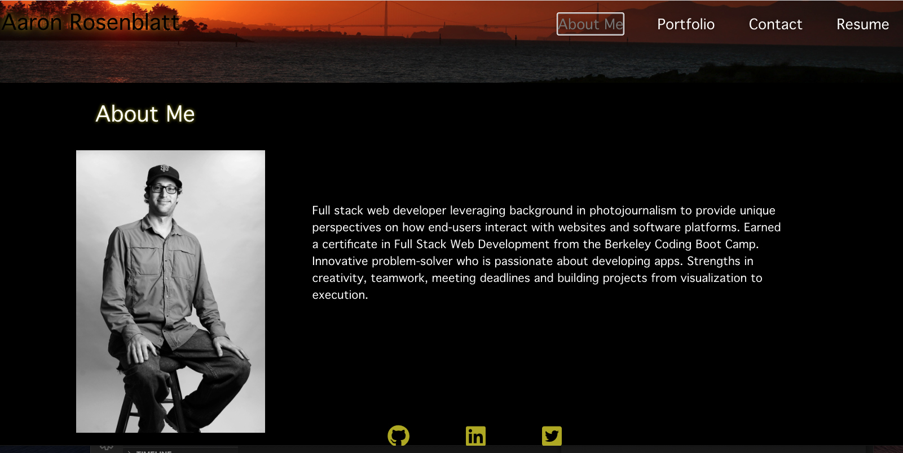

# Aaron Rosenblatt React Portfolio
## by Aaron Rosenblatt

### I wrote code to build a portfolio showing links to samples about my selected projects, information about myself and my skills, and an option to fill out a form to contact me. The site was created using React. 

### Following the link to the portfolio, the user will be taken to the section "About Me". There is a header, a section for content and a footer. There will be four navigation titles: About Me, Portfolio, Contact and Resume. When the user clicks on a navigation title they will be taken to that corresponding section without the page reloading and that title will be highlighted. The "About Me" section will feature a picture of myself and a short bio. The "Portfolio" section features six titled images of six of my applications with links to both the deployed applications and the corresponding GitHub repository. The "Contact" section includes a form with fields for a name, an email address, and a message. When the user moves the cursor out of one of the form fields without entering text a notification for that field is presented. When the user enters text into the email address field they will see a notification if an invalid email address is inputted. The "Resume" section features a downloadable resume and a list of my skills. Finally, the "Footer" includes icon links to my GitHub and LinkedIn profiles and to my Twitter page. 

### Aaron Rosenblatt React Portfolio can be viewed here: https://noplur.github.io/coding-port/

### The GitHub repository for Aaron Rosenblatt React Portfolio can be viewed here: https://github.com/noplur/coding-port

### Here is a screenshot of a sample from Aaron Rosenblatt React Portfolio:
### 